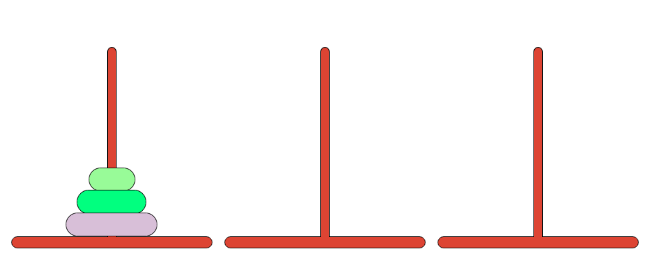

# Tower of Hanoi

## Objective
Move all the disks from the first tower to the last tower.

## Rules
* Only one disk can be moved at a time.
* A larger disk cannot be placed onto a smaller disk.

## Tasks
1. Model the tower/disk data.
2. Visually represent (print) the modeled tower/disk data.
3. Gather input from the user.
4. Move a disk from one tower to another within the rules of the game.
5. Keep track of the number of moves made.
6. Respond to a winning scenario.

### Other Considerations
Provide error feedback to the user whenever a rule is broken.
* **Errors**
    * Invalid tower number
    * Move from empty tower
    * Move larger disk onto smaller disk
